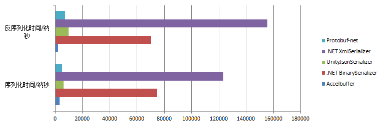
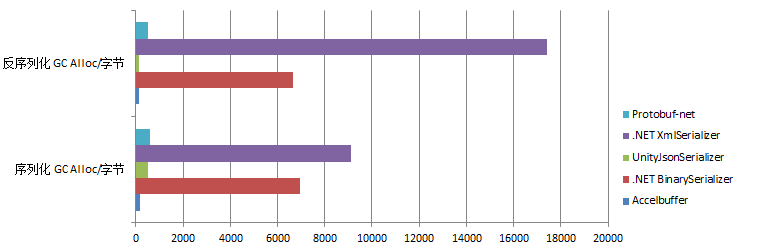
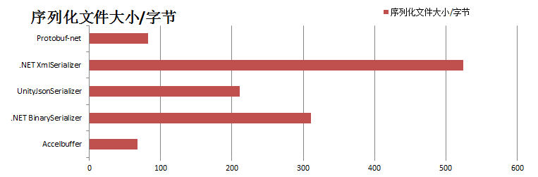

# Accelbuffer - preview
`Accelbuffer` 是一个快速，高效的序列化系统，可以用于数据持久化、网络数据传输等。

## 运行时支持
* `.NET Framework 4.6+`
* `/unsafe`

## 特点
* 时间消耗极低
* 托管堆内存分配接近于对象的真实大小，减少GC带来的性能问题
* 对于值类型，无装箱、拆箱
* 可以完全自定义的序列化流程
* 自动的运行时代理注入 (测试版本，当前不受到完全支持)
* 自动的C#代理代码生成 [`accelc`] (正在开发中)

## 部分功能
|功能名称|当前是否支持|
|:-:|:-:|
|简单类型序列化(`sbyte`, `byte`, `short`, `ushort`, `int`, `uint`, `long`, `ulong`, `char`, `string`, `float`, `double`, `bool`),对于`double`类型目前可能存在较小的精度误差|支持|
|字符编码设置(`ASCII`, `Unicode`, `UTF-8`)|支持|
|动态长度数字(`VariableNumber`)，固定长度整数(`FixedNumber`)|支持|
|序列化事件回调接口(`ISerializeMessageReceiver`)|支持|
|序列化数据损坏检查(`StrictMode`)|支持|
|运行时代理注入(`RuntimeSerializeProxyInjection`)|不完全支持|
|C#代理脚本自动生成(`accelc`)|目前不受支持|

## 运行时代理注入`RuntimeSerializeProxyInjection`
* 利用`System.Reflection.Emit`向运行时注入`IL`代码，生成默认的序列化代理，这个过程性能消耗较大，如果使用该方案，
应该尽量在加载场景等位置进行代理初始化(调用`Serializer<T>.Initialize()`方法，这个方法什么都不会做，仅为了调用静态构造函数)

#### `RuntimeSerializeProxyInjection`支持的字段类型
* `sbyte`, `byte`, `short`, `ushort`, `int`, `uint`, `long`, `ulong`, `char`, `string`, `float`, `double`, `bool` 
* 更多类型将在不久后支持

## 可以直接使用`Serializer<T>`进行序列化的类型
* `sbyte`, `byte`, `short`, `ushort`, `int`, `uint`, `long`, `ulong`, `char`, `string`, `float`, `double`, `bool` 

* `sbyte[]`, `byte[]`, `short[]`, `ushort[]`, `int[]`, `uint[]`, `long[]`, `ulong[]`, `char[]`, `string[]`, `float[]`, `double[]`, `bool[]` 

* `List<sbyte>`, `List<byte>`, `List<short>`, `List<ushort>`, `List<int>`, `List<uint>`, `List<long>`, `List<ulong>`, `List<char>`, `List<string>`, `List<float>`, `List<double>`, `List<bool>` 

* 定义了对应的`ISerializeProxy<T>`并且标记了`SerializeContractAttribute`指定代理的任意类型

* 标记了`SerializeContractAttribute`拥有默认无参构造函数并且字段类型被`RuntimeSerializeProxyInjection`支持的任意类型

## 基本用法
### 1.使用特性标记类型
#### 方案一，利用`RuntimeSerializeProxyInjection`
```c#
[SerializeContract(InitialBufferSize = 20L, StrictMode = true)]
public struct UserInput
{
  [SerializeIndex(0), VariableNumber] public int CarId;
  [SerializeIndex(1), VariableNumber] public float Horizontal;
  [SerializeIndex(2), VariableNumber] public float Vertical;
  [SerializeIndex(3), VariableNumber] public float HandBrake;
}
```

#### 方案二，手动实现代理
```c#
[SerializeContract(typeof(UserInputSerializeProxy), InitialBufferSize = 20L, StrictMode = true)]
public struct UserInput
{
  public int CarId;
  public float Horizontal;
  public float Vertical;
  public float HandBrake;
}

public sealed class UserInputSerializeProxy : ISerializeProxy<UserInput>
{
  unsafe void ISerializeProxy<UserInput>.Serialize(in UserInput* obj, in OutputBuffer* buffer)
  {
    buffer->WriteValue(0, obj.CarId, false);
    buffer->WriteValue(1, obj.Horizontal, false);
    buffer->WriteValue(2, obj.Vertical, false);
    buffer->WriteValue(3, obj.HandBrake, false);
  }

  unsafe UserInput ISerializeProxy<UserInput>.Deserialize(in InputBuffer* buffer)
  {
    return new UserInput
    {
      CarId = buffer->ReadVariableInt32(0),
      Horizontal = buffer->ReadVariableFloat32(1),
      Vertical = buffer->ReadVariableFloat32(2),
      HandBrake = buffer->ReadVariableFloat32(3)
    };
  }
}
```

#### 方案三，利用C#代理脚本生成(`accelc`)
- 即将被支持

### 2.序列化对象
```c#
UserInput input = new UserInput { CarId = 1, Horizontal = 0, Vertical = 0, HandBrake = 0 };
byte[] data = Serializer<UserInput>.Serialize(input);
```

### 3.反序列化对象
```c#
byte[] data = File.ReadAllBytes(someFile);
ArraySegment<byte> bytes = new ArraySegment<byte>(data);
UserInput input = Serializer<UserInput>.Deserialize(bytes);
```

### 4.释放缓冲区内存
- 缓冲区内存从非托管内存中分配
- 如果一个类型的序列化器经常被使用，可以选择不释放内存，以减少内存的频繁分配
```c#
Serializer<UserInput>.FreeBufferMemory();
```

### 5.序列化事件回调接口(`ISerializeMessageReceiver`)
通过实现`ISerializeMessageReceiver`接口关注`OnBeforeSerialize`和`OnAfterDeserialize`事件，类似Unity的`ISerializationCallbackReceiver`
- 对于值类型，该操作会导致装箱
```c#
[SerializeContract(InitialBufferSize = 20L, StrictMode = true)]
public struct UserInput : ISerializeMessageReceiver
{
  [SerializeIndex(0), VariableNumber] public int CarId;
  [SerializeIndex(1), VariableNumber] public float Horizontal;
  [SerializeIndex(2), VariableNumber] public float Vertical;
  [SerializeIndex(3), VariableNumber] public float HandBrake;
  
  //装箱
  void ISerializeMessageReceiver.OnBeforeSerialize()
  {
    UnityEngine.Debug.Log("OnBeforeSerialize");
  }
  
  //装箱
  void ISerializeMessageReceiver.OnAfterDeserialize()
  {
    UnityEngine.Debug.Log("OnAfterDeserialize");
  }
}
```

## 性能对比
> 数据不存在JIT的影响，但可能存在允许范围内的部分误差

- 测试类型

```C#
[Serializable, ProtoContract, SerializeContract(InitialBufferSize = 50L, StrictMode = true)]
public struct SerializeTest
{
  [ProtoMember(1), SerializeIndex(0),   Encoding(CharEncoding.ASCII)] public string String;
  [ProtoMember(2), SerializeIndex(1),   Encoding(CharEncoding.ASCII)] public char Char;
  [ProtoMember(3), SerializeIndex(2)]                                 public byte Integer0;
  [ProtoMember(4), SerializeIndex(3)]                                 public sbyte Integer1;
  [ProtoMember(5), SerializeIndex(4),   VariableNumber]               public ushort Integer2;
  [ProtoMember(6), SerializeIndex(5),   VariableNumber]               public short Integer3;
  [ProtoMember(7), SerializeIndex(6),   VariableNumber]               public uint Integer4;
  [ProtoMember(8), SerializeIndex(7),   VariableNumber]               public int Integer5;
  [ProtoMember(9), SerializeIndex(8),   VariableNumber]               public ulong Integer6;
  [ProtoMember(10), SerializeIndex(9),  VariableNumber]               public long Integer7;
  [ProtoMember(11), SerializeIndex(10), VariableNumber]               public float Float0;
  [ProtoMember(12), SerializeIndex(11), VariableNumber]               public double Float1;
  [ProtoMember(13), SerializeIndex(12)]                               public bool Bool;
}

SerializeTest test = new SerializeTest
{
  String = "hello world!",
  Char = 'A',
  Integer0 = 0,
  Integer1 = -1,
  Integer2 = 10,
  Integer3 = -10,
  Integer4 = 100,
  Integer5 = -100,
  Integer6 = 1000,
  Integer7 = -1000,
  Float0 = 10.666f,
  Float1 = 10.666,
  Bool = true
};
```




|序列化器名称|序列化 GC Alloc/字节|反序列化 GC Alloc/字节|序列化时间/纳秒|反序列化时间/纳秒|序列化文件大小/字节|
|:-:|:-:|:-:|:-:|:-:|:-:|
|Accelbuffer|180|130|3282|2028|68|
|Protobuf-net|614.4|512|5254|7345|83|
|UnityJsonSerializer|512|130|6308|9736|211|
|.NET BinarySerializer|6963.2|6656|74990|70290|311|
|.NET XmlSerializer|9113.6|17408|123171|155656|524|

## 支持
* 作者正在努力更新部分新的功能，这个序列化系统原本只是作者开发的Unity开源框架(在~~很久~~不久后也会开源)的一部分，由于没有对Unity的依赖而被单独分离，在这个序列化系统的大部分功能完善后，会继续着手开发Unity框架，同时不定期维护这个项目，更多细节可以参考源码，部分注释将在今后补全。

* 作者联系方式 QQ：1024751595
